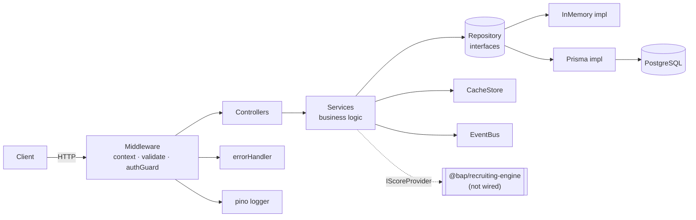
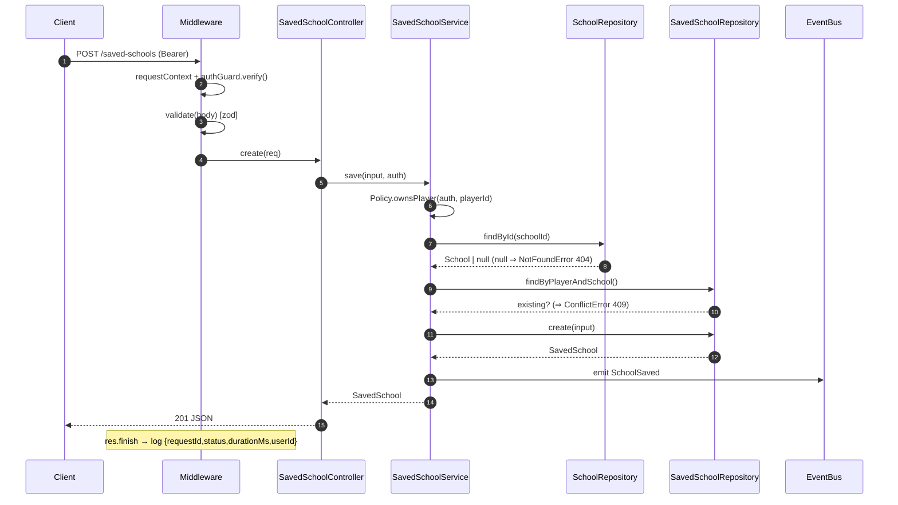
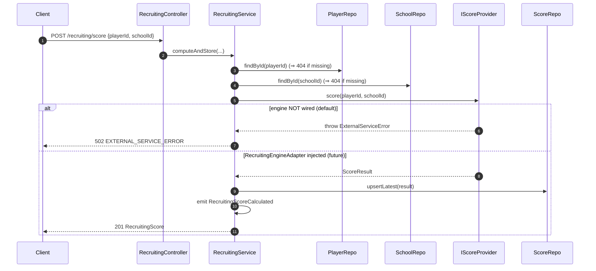

# Service diagrams

## Component view

```mermaid
flowchart LR
  Client -->|HTTP| MW[Middleware<br/>context · validate · authGuard]
  MW --> C[Controllers]
  C --> S[Services<br/>business logic]
  S --> R[(Repository<br/>interfaces)]
  R --> IM[InMemory impl]
  R --> PR[Prisma impl]
  PR --> DB[(PostgreSQL)]
  S --> Cache[CacheStore]
  S --> Bus[EventBus]
  S -. IScoreProvider .-> Eng[["@bap/recruiting-engine<br/>(not wired)"]]
  MW --> Err[errorHandler]
  MW --> Log[pino logger]
```

## Sequence — `POST /api/saved-schools`

```mermaid
sequenceDiagram
  autonumber
  participant Cl as Client
  participant MW as Middleware
  participant Ct as SavedSchoolController
  participant Sv as SavedSchoolService
  participant SR as SchoolRepository
  participant DR as SavedSchoolRepository
  participant EB as EventBus

  Cl->>MW: POST /saved-schools (Bearer)
  MW->>MW: requestContext + authGuard.verify()
  MW->>MW: validate(body) [zod]
  MW->>Ct: create(req)
  Ct->>Sv: save(input, auth)
  Sv->>Sv: Policy.ownsPlayer(auth, playerId)
  Sv->>SR: findById(schoolId)
  SR-->>Sv: School | null  (null ⇒ NotFoundError 404)
  Sv->>DR: findByPlayerAndSchool()
  DR-->>Sv: existing? (⇒ ConflictError 409)
  Sv->>DR: create(input)
  DR-->>Sv: SavedSchool
  Sv->>EB: emit SchoolSaved
  Sv-->>Ct: SavedSchool
  Ct-->>Cl: 201 JSON
  Note over MW: res.finish → log {requestId,status,durationMs,userId}
```

## Sequence — `POST /api/recruiting/score` (engine boundary)

```mermaid
sequenceDiagram
  autonumber
  participant Cl as Client
  participant Ct as RecruitingController
  participant Sv as RecruitingService
  participant PR as PlayerRepo
  participant SR as SchoolRepo
  participant SP as IScoreProvider
  participant ScR as ScoreRepo

  Cl->>Ct: POST /recruiting/score {playerId, schoolId}
  Ct->>Sv: computeAndStore(...)
  Sv->>PR: findById(playerId)  (⇒ 404 if missing)
  Sv->>SR: findById(schoolId)  (⇒ 404 if missing)
  Sv->>SP: score(playerId, schoolId)
  alt engine NOT wired (default)
    SP-->>Sv: throw ExternalServiceError
    Sv-->>Cl: 502 EXTERNAL_SERVICE_ERROR
  else RecruitingEngineAdapter injected (future)
    SP-->>Sv: ScoreResult
    Sv->>ScR: upsertLatest(result)
    Sv->>Sv: emit RecruitingScoreCalculated
    Sv-->>Cl: 201 RecruitingScore
  end
```
